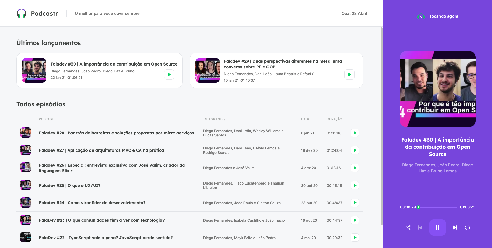

This is a [Next.js](https://nextjs.org/) project bootstrapped with [`create-next-app`](https://github.com/vercel/next.js/tree/canary/packages/create-next-app)

<h1 align="center">
    <br><br/>
    <h3 align="center" >NLW#5 - Rocketseat</h3>
</h1>


<p align="center">
  <a href="#bookmark-sobre">Sobre</a>&nbsp;&nbsp;&nbsp;|&nbsp;&nbsp;&nbsp;
  <a href="#rocket-tecnologias">Tecnologias</a>&nbsp;&nbsp;&nbsp;|&nbsp;&nbsp;&nbsp;
  <a href="#boom-como-executar">Como Executar</a>&nbsp;&nbsp;&nbsp;|&nbsp;&nbsp;&nbsp;
</p>

<p align="center">
  
<p>

## :bookmark: Sobre

O Podcastr é uma plataforma para trasmissão de podcast's.
  
Essa aplicação foi realizada durante a trilha de ReactJS da **Next Level Week #5** ofertada pela **Rocketseat**.

## :rocket: Tecnologias

-  [ReactJS](https://pt-br.reactjs.org/)
-  [Next.js](https://nextjs.org/)
-  [TypeScript](https://www.typescriptlang.org/)

## :boom: Como Executar

- ### **Pré-requisitos**

  - É **necessário** possuir o **[Node.js](https://nodejs.org/en/)** instalado no computador
  - É **necessário** possuir o **[Git](https://git-scm.com/)** instalado e configurado no computador
  - Também, é **preciso** ter um gerenciador de pacotes como o **[NPM](https://www.npmjs.com/)**.

1. Faça um clone do repositório:

```sh
  $ git clone https://github.com/thallesyasmim/Podcastr.git
```

2. Executando a Aplicação:

```sh
  # Podcastr
  $ cd podcastr_nextjs
  # Instalando as dependências do projeto.
  $ npm install ou yarn 
  # Inicie o servidor (Fake API)
  $ npm run server ou yarn server 
  # Inicie o cliente
  $ npm run dev ou yarn dev 
```

<h2>⚒ Melhorias à fazer: </h2>
* Criar versão mobile<br>
* Criar scrapper para indexar automaticamente podcasts de tecnologia<br>
* Criar versao pwa<br>


